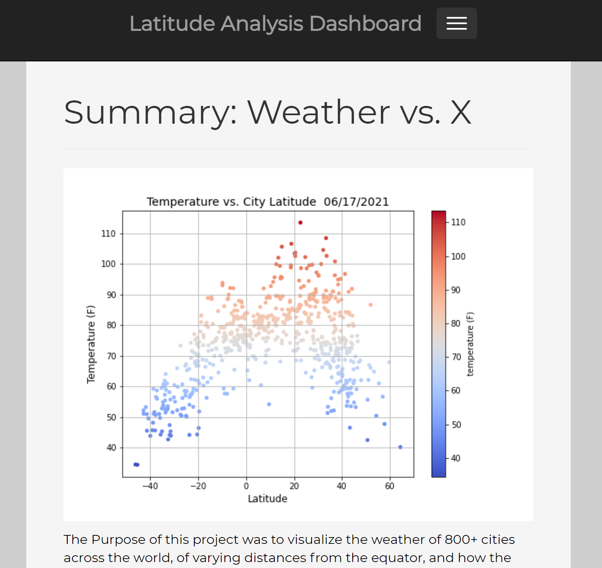

# Web Design Homework - Web Visualization Dashboard (Latitude)

## Deployment Link: 
[Web Visualization](https://speedracer05.github.io/Web-Design-Challenge/index.html)

## Background
The Purpose of this project was to visualize the weather of 800+ cities across the world, of varying distances from the equator, and how the cities weather changes as you get closer to the equator. To build this analysis I used a Python library and OpenWeatherMap API to randomly generate 1,500 geo-coordinates and find nearby cities. City names then were transformed into geo-coordinates, with current, local weather conditions. Next, I utilized Google's Maps JavaScript API, and previously collected cities data to create and overlay a heatmap onto Google Maps. Summer-like weather criteria were then used to programmatically filter, and select a dozen cities for my next adventure.

## Latitude - Latitude Analysis Dashboard with Attitude

For this project I created a visualization dashboard website, using visualizations that I had created in a past assignment.

In building this dashboard, I created individual pages for each plot, and a means to navigate between them. The pages contain the visualizations and corresponding explanations. in addition, there is a landing page, a page comparing the plots, and another page to view the data used to build them.
